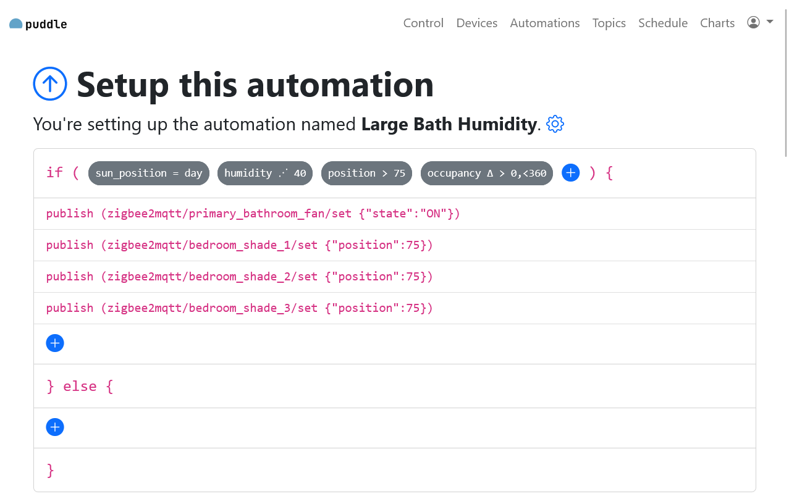

# Puddle


A simple home control and automation runner for [mqtt](https://mqtt.org). Provides an API for custom frontends or use the included web interface. Runs on [Node.js](https://nodejs.org).

Developed for use with zigbee devices through [zigbee2mqtt](https://www.zigbee2mqtt.io/), but any mqtt devices *should* 🤞 work.

## Features
* Schedule and trigger automations based on mqtt topics, sun position (with [suncalc](https://github.com/mourner/suncalc)) or time
* Allows conditionals (if/else) based on mqtt topics, sun position, time, etc...
* Provides an API for custom frontends or use the included web frontend built with [hapi](https://hapi.dev), [joi](https://joi.dev) and [Bootstrap](https://getbootstrap.com)
* Stores messages in a [SQLite](https://www.sqlite.org) db for charting (with [Chart.js](https://www.chartjs.org/)) or automation conditions
* Query past and present device states for automations
* Quick access to favorite device states (e.g., temperature, humidity)
* Provides an interface for manually controlling devices and an overview of all mqtt topics and their use
* Autodetected and manual entry of mqtt topics

## Getting started
Be sure to setup a `puddle.env` and `secret.env` files in the root folder. See the samples of these files for examples. A latitude and longitude should be provided in `puddle.env` for calculating sun positions.

The `secret.env` file sets a authorization phrase for adding users and resetting passwords. This can be disabled once a user account is created.

To setup puddle, its db, and the web frontend run (note the different subdirectories):
```console
[puddle_folder]$ npm install
[puddle_folder]$ npm run migrate latest
[puddle_webapp_folder]$ npm install
[puddle_webapp_folder]$ npm run parcel:build
```

Puddle startup:
```console
[puddle_folder]$ npm run prod
```

The web frontend should now be running at `http://localhost:4000` (unless you've changed the default port).

## Features (illustrated)
Home page


Charts


Automation setup



Control a toggleable device


Control a positionable device


## Development

Puddle is beta software and, along with this `README.md`, is a work in progress.

Start the backend and web frontend in watch mode with:

```console
[puddle_folder]$ npm run dev
[puddle_webapp_folder]$ npm run parcel:watch
```